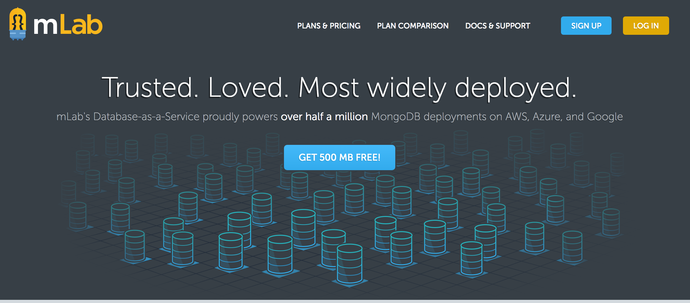

bleeding-edge-sample-app-refacor
========================

## 简介

此页面本是《REACT：引领未来的用户界面开发框架》例子，不过所用技术仅仅是React+Flux，所以小生把它重构了一下！

[线上页面](https://p-survey.herokuapp.com)

## 技术栈

* 1、[ES6](http://es6.ruanyifeng.com/)，峰哥出品必属精品！
* 2、[React](https://facebook.github.io/react/docs/hello-world.html)，还是看英文吧，先前的中文网站已经关闭了，悲剧！
* 3、[redux](http://cn.redux.js.org/index.html)，包括`react-redux`，源码不多，最好看源码！
* 4、[react-router](http://react-guide.github.io/react-router-cn/index.html)，用`context`传递属性
* 5、[react-router-redux](http://www.8dou5che.com/2017/01/22/react-router-redux/)，用它之前，要搞清楚它是干嘛使的！
* 6、[immutable](http://facebook.github.io/immutable-js/docs/#/)，当然它还有一个兄弟[seamless-immutable](https://www.npmjs.com/package/seamless-immutable)短小精悍，自己选择吧！
* 7、[webpack](http://webpack.github.io/)，小生用的是1，2还没看！
* 8、[express](http://www.expressjs.com.cn/4x/api.html)，搭`node`后台，照着文档干！
* 9、[mongodb](http://www.runoob.com/mongodb/mongodb-tutorial.html)，比`sql server`易上手！

## 免费资源

1、[免费的数据库-mlab](https://mlab.com/)

2、[免费的服务器](https://devcenter.heroku.com/)

